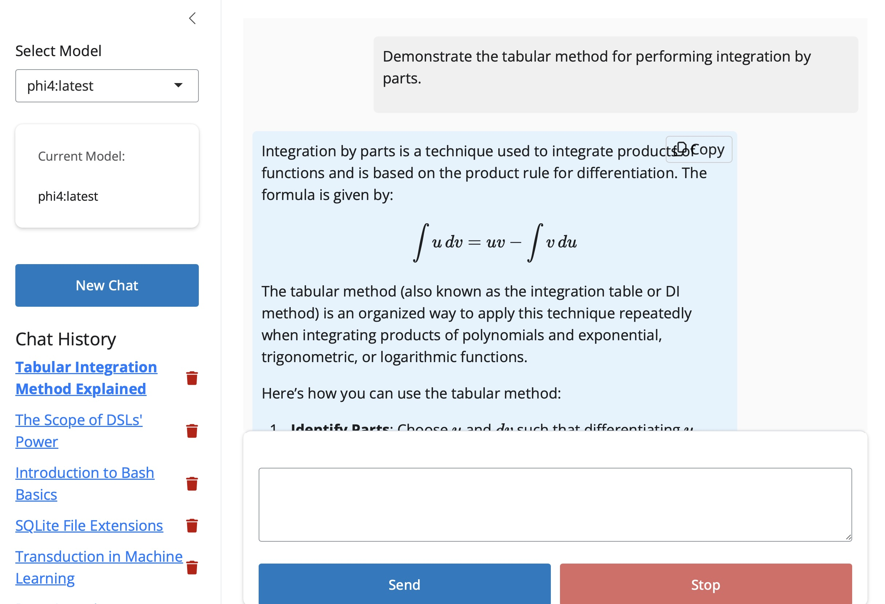

# chatr

A modern Shiny-based chat interface for local language models, built to
demonstrate the bare-bones functionality of a modern chatbot.



## Introduction

**chatr** is a Shiny web application that provides a clean, simple interface
for interacting with local language models. Built in about a day using various
LLMs (**o1**, **o1-mini**, **Claude 3.5 Sonnet**, and **Gemini 2.0 Flash**), it
combines the power of R's Shiny framework with modern web technologies to make
the functionality of modern chatbots more transparent.

## Key Features

- **Real-time Streaming**: Messages appear token by token as they're generated
- **Markdown Support**: Full markdown rendering including LaTeX math expressions
- **Chat History**: Persistent storage of conversations using SQLite
- **Multiple Models**: Support for various local LLMs including Phi-2, Gemma, and Llama
- **Copy to Clipboard**: One-click copying of any assistant response
- **Keyboard Shortcuts**: Use Cmd/Ctrl + Enter to send messages
- **Stop Generation**: Ability to halt response generation mid-stream
- **Automatic Titles**: Smart conversation titling based on content
- **Mobile-Friendly**: Responsive design that works on all devices

## Requirements

- R 4.0 or later
- Required R packages:
  ```r
  install.packages(c(
    "shiny",
    "DBI",
    "RSQLite",
    "ellmer",
    "markdown",
    "shinyjs",
    "bslib"
  ))
  ```
- A local Ollama installation (for the language models)

## Setup

1. **Clone/Download**
   ```bash
   git clone <repository-url>
   cd chatr
   ```

2. **Environment Configuration**
   Create an `.Renviron` file in the app directory:
   ```
   OLLAMA_BASE_URL=http://127.0.0.1:11434
   ```
   Adjust the URL to match your Ollama server location.

3. **Database Initialization**
   The app will automatically create a SQLite database (`chat_history.sqlite`)
   on first run.

4. **Launch**
   ```r
   shiny::runApp("path/to/chatr")
   ```

## Basic Features

- Uses `RSQLite` for persistent storage
- Implements MathJax for LaTeX rendering
- Features streaming and rendering

## Acknowledgments

Built with R Shiny and inspired by modern chat interfaces like ChatGPT.
